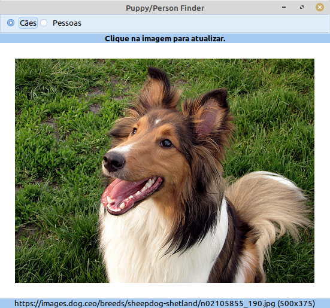
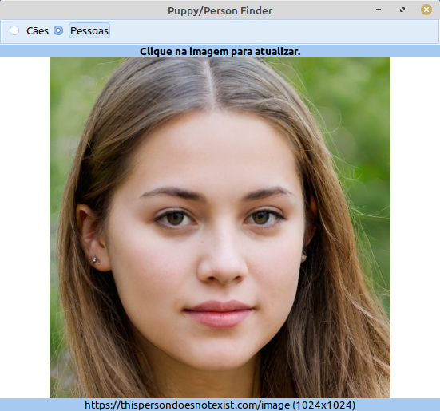

# puppy-person

## Introdução

É um pequeno aplicativo para mostrar imagens de dois sites.

- https://dog.ceo/api/breeds/image/random retorna um objeto JSON com o endereço para uma imagem de cães. Você irá buscar o link para a imagem, ler e apresentar no componente TImage do Lazarus. Original: [Puny GUI Puppy Finder](https://github.com/red/code/blob/master/Showcase/puppy-finder.red)

- https://thispersondoesnotexist.com/image retorna uma imagem de uma pessoa que não existe, gerada por IA. Na página você obtém mais informações.

## Habilidades

Estudando o código, você aprenderá:

- conectar em uma página https
- ler um conteúdo json
- tratar o conteúdo json
- ler uma imagem da internet
- apresentar a imagem no seu programa.

## Observações

- Primeiro e mais importante: o programa não trata os erros. 

## Componentes

TImage, TRadioGroup, TLabel, TFPHTTPClient, TMemoryStream, TJSONData

## Programa

