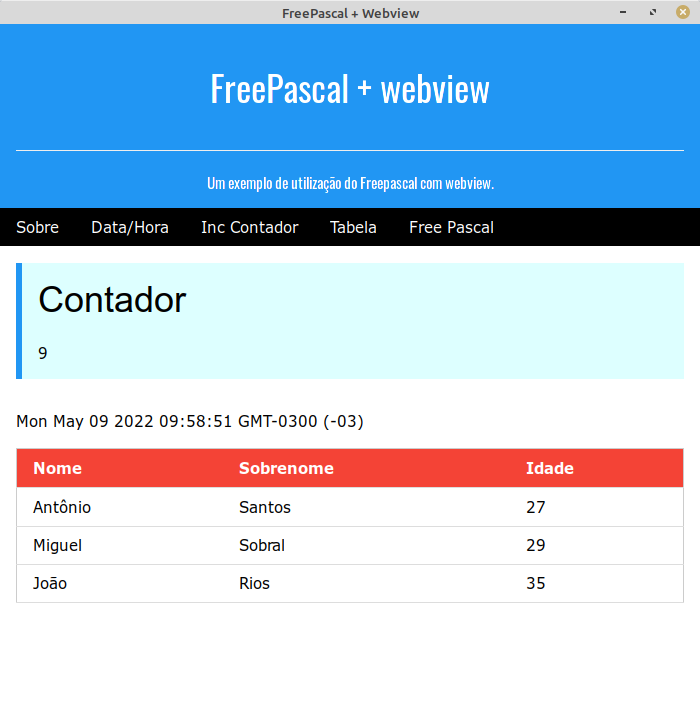

# Free Pascal + webview

## Introdução

Basicamente permite o desenvolvimento de aplicações usando a tecnologia web para desktop. [Webview](https://github.com/webview/webview) é uma biblioteca que permite a comunicação de uma linguagem com javascript e o contrário. Usa Cocoa/WebKit no macOS, gtk-webkit2 no Linux e Edge no Windows 10. Para a utilização do webview você precisará do [fpwebview](https://github.com/PierceNg/fpwebview) (o PierceNg já gerou as bibliotecas x86_64_para Linux/Windows e MacOS). Você deverá utilizar o `webview.pas` para a integração com a biblioteca. O resultado final seria algo como:



## FAQ

- **Posso utilizar com o Lazarus apenas para mostrar uma página?** Por enquanto não. O Lazarus usa o GTK2 e não é possível utilizar GTK2 e GTK3 na mesma aplicação.

- **Posso utilizar no meu Windows 16 bits?** Não testei mas a primeira coisa a fazer seria gerar a dll do webview para 16 bits e testar.

- **Posso usar o Lazarus apenas para gerar as telas?** Bem, até seria possível mas voce deveria criar um programa para converter as telas para o framework que você utilizará.

- **Preciso instalar a webview no linux?** Não necessariamente. Você pode colocar a biblioteca no mesmo diretório do executável e passar para o linker a opção `-rpath=./`e, caso a biblioteca não seja encontrada nos caminhos definidos, será procurarda no mesmo diretório do executável.

## Desenvolvimento

A primeira coisa é desenvolver as telas da sua aplicação como páginas html. Aqui também pode ser a hora de definir um framework para a formatação das páginas. Utilizei o [w3.css](https://www.w3schools.com/w3css/default.asp) que é pequeno e simples. Você poderá optar por outros como o [Bootstrap](https://getbootstrap.com/), [Bulma](https://bulma.io/) e mais um monte que existem para baixar. Pessoalmente não trabalho e nem gosto da turma HTML+CSS+JS. Se eu falar besteira, esqueçam (ou me corrijam).

Para o meu exemplo, criei três arquivos html:

- **head.html** que contém o código do início até antes do <body>

- **foot.html** que contém o código final da página onde coloquei <script> até </html>

- **body.html** que possui a aplicação propriamente dita.

Agora temos o primeiro problema. Utilizei um editor para trabalhar com os arquivos html (poderia ser o do próprio Lazarus) para ter uma visão melhor das páginas. Mas eles possuem múltiplas linhas e não podem ser lidos diretamente para uma variável. O Pascal não aceita heredoc ou string multilinhas como as linguagens mais modernas. Uma das poucas coisas que uma string em Pascal não pode ter é nova linha. Colocar apóstrofe e + em cada linha é um trabalho que ninguém merece. Resumindo, fiz um programinha em Nim (sim, podia ser em pascal ou qualquer outra linguagem) que vai ler todos os arquivos .html, eliminar todas as quebras de linha e dobrar os apóstrofos para não causar erro quando fizer `body = {$INCLUDE body.inc}`. O programa em nim ficou assim:

```nim
import std/[os,strutils]

proc html2inc(fi:string) =
  let fo = splitFile(fi)[1] & ".inc"
  echo fi," -> ",fo
  let content = readFile(fi)
  writeFile(fo, "'" & content.replace("\n","").replace("'","''") & "';")


for f in walkFiles("*.html"):
  html2inc(f)
```

O resultado é apenas uma linha mas, como você vai editar os arquivos .html e o compilador não se importa como está o .inc vamos deixar assim.

## O programa

Você pode ver o fonte do prorama em `fpwebview.pas`. Basicamente temos as procedures que irão retornar o resultado para a chamada do JavaScript. Note que estão como `cdecl` e o retorno é dado por `webview_return`.

Depois temos a inicialização do webview informando título, tamanho da janela, conteúdo, inicio e finalização. 

A parte mais importante é o mapeamento da função JavaScript para o nosso procedimento em pascal que é feito por:

```objectpascal
webview_bind(w, PChar('HostContador'), @Contador, nil);
```

Significa que a função `HostContador` em JavaScript na página irá chamar `procedure Contador...` em pascal.

## Biblioteca

No Windows, basta colocar a .dll na mesma pasta do executável que ela é encontrada. No Linux, se não estiver instalada, seria necessário iniciar o programa iniciando a varável `LD_LIBRARY_PATH` para que seja encontrada. Ou utilizar uma chave para o linker dizendo para procurar a biblioteca em um diretório especificado. Pela linha de comando basta utilizar `-k-rpath=./` que, caso a biblioteca não seja encontrada nos diretórios padrões em caso de omissão, seja procurada no mesmo diretório do programa. Utilizando o Lazarus para a edição do programa (o que é mais aconselhável) é possível ir em `Opções do projeto`, `Opções do compilador`, `Compilação e vinculação`, marcar a caixa `Enviar opções ao vinculador com -k` e preencher o texto com `-rpath=./`.

## Futuro

Pretendo colocar mais algumas coisas no program mas ainda não decidi (talvez usar uma biblioteca em JS para a geração de gráficos ou pdf) bem como avaliar uma função JS utilizando o `webview_eval`.
